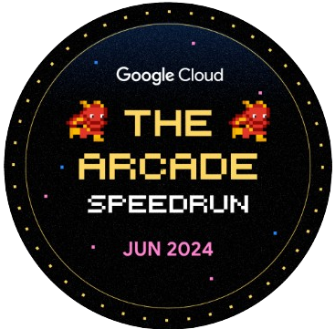

  
  <h1>Hi, I'm Nyoman Kusuma</h1>

  

  

<table width="100%">
  <tr>
    <td valign="top" width="60%">

### 👨‍💻 About Me

**Information Systems Student** from **South Sumatra, Indonesia** 🇮🇩

I specialize in building scalable web apps and designing intuitive digital experiences. Passionate about transforming complex problems into elegant solutions.

  

### 🏆 Badges

  
  
  
  
  

  

### 🚀 What I Do?

* 💻 **Develop:** Full-stack platforms using **Next.js, TypeScript, & Supabase** (e.g., *Smardetu*).
* 🎨 **Design:** User-centric UI/UX for mobile & web apps (e.g., *Aduan Kito*).
* 💡 **Innovate:** Creating tech solutions for social impact.

  

### 🛠️ Tech Stack & Tools

**Frontend**
 

**Backend & Cloud**
 

**Design**
 

  

### 📫 Connect with Me

  
  
  

</td>
<td align="center" width="40%">

  

 

</td>
  </tr>
</table>

<h2 align="center">📊 GitHub Analytics</h2>

  
  

 

  

